# Complete Class Management System - Comprehensive Flowchart

This document provides a comprehensive, detailed flowchart covering all class management operations: Project Creation, Class Addition, Class Merging, and Class Splitting.

---

## Complete System Flowchart

```mermaid
flowchart TD
    Start([User Accesses System]) --> MainMenu{Select Operation}
    
    %% PROJECT CREATION PATH
    MainMenu -->|Create Project| ProjectStart([Project Creation])
    ProjectStart --> CheckAuth{User Authenticated?}
    CheckAuth -->|No| AuthError[Show Error:<br/>Must be logged in]
    AuthError --> Start
    
    CheckAuth -->|Yes| ShowProjectForm[Display Project Form]
    ShowProjectForm --> UserProjectInput[User Enters:<br/>- project_code 3 chars<br/>- project_title<br/>- description<br/>- poc_name, poc_email, poc_phone<br/>- latitude, longitude<br/>- area, dates, privacy]
    
    UserProjectInput --> ValidateProject{Validate Project Data}
    ValidateProject -->|Invalid Email| EmailError[Show Error:<br/>Invalid email format]
    EmailError --> UserProjectInput
    
    ValidateProject -->|Invalid Code| CodeError[Show Error:<br/>Code must be 3 alphanumeric]
    CodeError --> UserProjectInput
    
    ValidateProject -->|Invalid Phone| PhoneError[Show Error:<br/>Invalid phone format]
    PhoneError --> UserProjectInput
    
    ValidateProject -->|Invalid Coords| CoordError[Show Error:<br/>Invalid lat/lon]
    CoordError --> UserProjectInput
    
    ValidateProject -->|Title Has URL| TitleError[Show Error:<br/>Title cannot contain URLs]
    TitleError --> UserProjectInput
    
    ValidateProject -->|All Valid| CheckProjectExists{Project Code<br/>Already Exists?}
    
    CheckProjectExists -->|Yes| UpdateProject[POST /submit<br/>Backend: Update Project]
    CheckProjectExists -->|No| CreateProject[POST /submit<br/>Backend: Create Project]
    
    UpdateProject --> UpdateDB[(Database: UPDATE projects)]
    UpdateDB --> UpdateSuccess[Return Success:<br/>Project Updated]
    
    CreateProject --> InsertProjectDB[(Database: INSERT INTO projects)]
    InsertProjectDB --> CheckClasses{Classes<br/>Provided?}
    
    CheckClasses -->|Yes| ProcessClasses[Process Classes Array]
    CheckClasses -->|No| ProjectCreated[Project Created<br/>No Classes]
    
    ProcessClasses --> LoopClasses{For Each Class}
    LoopClasses --> ValidateClass{Validate Class Name}
    ValidateClass -->|Invalid Format| ClassFormatError[Error:<br/>lowercase_underscores only]
    ClassFormatError --> LoopClasses
    
    ValidateClass -->|Valid| CheckModelClass{Class in Model<br/>Training Set?}
    CheckModelClass -->|Yes| SetModelFlag[Set is_model_class = 1]
    CheckModelClass -->|No| SetManualFlag[Set is_model_class = 0<br/>Show Warning]
    
    SetModelFlag --> InsertClassDB[(INSERT INTO class_details<br/>project_code, class_name,<br/>formatted_class_name,<br/>description, is_model_class)]
    SetManualFlag --> InsertClassDB
    
    InsertClassDB --> CheckMoreClasses{More Classes?}
    CheckMoreClasses -->|Yes| LoopClasses
    CheckMoreClasses -->|No| CommitProject[COMMIT Transaction]
    
    CommitProject --> ProjectCreated
    ProjectCreated --> ShowProjectSuccess[Show Success Message]
    ShowProjectSuccess --> EndProject([Project Created Successfully])
    
    UpdateSuccess --> EndProject
    
    %% CLASS ADDITION PATH
    MainMenu -->|Add Class| ClassAddStart([Class Addition])
    ClassAddStart --> CheckProjectSelected{Project Selected?}
    CheckProjectSelected -->|No| ProjectError[Show Error:<br/>Select Project First]
    ProjectError --> ClassAddStart
    
    CheckProjectSelected -->|Yes| ShowClassForm[Display Class Creation Form]
    ShowClassForm --> UserClassInput[User Enters:<br/>- class_name lowercase_underscores<br/>- formatted_class_name<br/>- description optional]
    
    UserClassInput --> ValidateClassInput{Validate Input}
    ValidateClassInput -->|Empty Name| NameError[Show Error:<br/>Class name required]
    NameError --> UserClassInput
    
    ValidateClassInput -->|Invalid Format| FormatError[Show Error:<br/>Must be lowercase_underscores]
    FormatError --> UserClassInput
    
    ValidateClassInput -->|Valid| CheckModelClassAdd{Class in Model<br/>Training Set?}
    
    CheckModelClassAdd -->|No| ShowModelWarning[Show Warning:<br/>Class not in model.<br/>Will require manual classification]
    ShowModelWarning --> UserConfirm{User Confirms?}
    UserConfirm -->|No| UserClassInput
    UserConfirm -->|Yes| CreateClassAPI[POST /create_class]
    
    CheckModelClassAdd -->|Yes| CreateClassAPI
    
    CreateClassAPI --> BackendValidate{Backend Validation}
    BackendValidate -->|Project Invalid| ReturnProjectErr[Return Error:<br/>Project does not exist]
    ReturnProjectErr --> ProjectError
    
    BackendValidate -->|Class Exists| ReturnClassErr[Return Error:<br/>Class already exists<br/>for this project]
    ReturnClassErr --> UserClassInput
    
    BackendValidate -->|Valid| InsertClassDetails[(Database: INSERT INTO class_details<br/>project_code, class_name,<br/>formatted_class_name,<br/>description, is_model_class)]
    
    InsertClassDetails --> CheckUniqueConstraint{Unique Constraint<br/>project_code + class_name?}
    CheckUniqueConstraint -->|Violation| ReturnClassErr
    CheckUniqueConstraint -->|OK| CommitClass[COMMIT Transaction]
    
    CommitClass --> ReturnClassSuccess[Return Success Response<br/>with is_model_class flag]
    ReturnClassSuccess --> UpdateClassUI[Update Frontend UI]
    UpdateClassUI --> RefreshClassList[Refresh Class List<br/>for Project]
    RefreshClassList --> ShowClassSuccess[Show Success Message]
    ShowClassSuccess --> EndClassAdd([Class Added Successfully])
    
    %% CLASS MERGING PATH
    MainMenu -->|Merge Classes| MergeStart([Class Merging])
    MergeStart --> CheckProjectMerge{Project Selected?}
    CheckProjectMerge -->|No| MergeProjectError[Show Error:<br/>Select Project First]
    MergeProjectError --> MergeStart
    
    CheckProjectMerge -->|Yes| LoadProjectClasses[Load Classes for Project]
    LoadProjectClasses --> ShowClassList[Display Class List<br/>with Multi-Select]
    ShowClassList --> UserSelectSources[User Selects Source Classes<br/>2 or more classes to merge]
    
    UserSelectSources --> CheckSelection{At Least 2<br/>Classes Selected?}
    CheckSelection -->|No| SelectionError[Show Error:<br/>Select at least 2 classes]
    SelectionError --> UserSelectSources
    
    CheckSelection -->|Yes| UserSelectTarget[User Selects Target Class<br/>Class to merge into]
    UserSelectTarget --> ValidateTarget{Target Class<br/>Selected?}
    ValidateTarget -->|No| TargetError[Show Error:<br/>Select target class]
    TargetError --> UserSelectTarget
    
    ValidateTarget -->|Yes| CheckSameProject{All Classes<br/>Same Project?}
    CheckSameProject -->|No| ProjectMismatch[Show Error:<br/>Cannot merge classes<br/>from different projects]
    ProjectMismatch --> UserSelectSources
    
    CheckSameProject -->|Yes| CheckTargetExists{Target Class<br/>Exists?}
    CheckTargetExists -->|No| TargetNotExists[Show Error:<br/>Target class does not exist]
    TargetNotExists --> UserSelectTarget
    
    CheckTargetExists -->|Yes| CheckTargetInSources{Target in<br/>Source List?}
    CheckTargetInSources -->|Yes| TargetInSources[Show Error:<br/>Target cannot be<br/>in source list]
    TargetInSources --> UserSelectTarget
    
    CheckTargetInSources -->|No| GetImageCounts[Get Image Counts<br/>for Each Source Class]
    GetImageCounts --> ShowMergePreview[Show Preview:<br/>- Source classes list<br/>- Target class<br/>- Image count per class<br/>- Total images to move]
    
    ShowMergePreview --> UserConfirmMerge{User Confirms Merge?}
    UserConfirmMerge -->|No| CancelMerge[Cancel Operation]
    CancelMerge --> EndMerge
    
    UserConfirmMerge -->|Yes| StartMergeTransaction[Start Database Transaction<br/>BEGIN TRANSACTION]
    
    StartMergeTransaction --> LoopMergeClasses{For Each Source Class}
    LoopMergeClasses --> UpdateImageData[(UPDATE image_data<br/>SET class_name = target_class<br/>WHERE class_name = source_class<br/>AND bin_name IN<br/>SELECT bin_name FROM bin_data<br/>WHERE project_code = ?)]
    
    UpdateImageData --> GetYearMonth[Extract year/month<br/>from bin_name pattern]
    GetYearMonth --> LoopFolders{For Each Year/Month<br/>Combination}
    
    LoopFolders --> GetSourcePath[Get Source Path:<br/>data_directory/project/year/month/source_class/]
    GetSourcePath --> GetTargetPath[Get Target Path:<br/>data_directory/project/year/month/target_class/]
    
    GetTargetPath --> CheckTargetFolder{Target Folder<br/>Exists?}
    CheckTargetFolder -->|No| CreateTargetFolder[Create Target Folder<br/>os.makedirs target_path]
    CheckTargetFolder -->|Yes| MoveImageFiles
    
    CreateTargetFolder --> MoveImageFiles[Move Image Files<br/>shutil.move all files<br/>from source to target]
    
    MoveImageFiles --> CheckEmptySource{Source Folder<br/>Empty?}
    CheckEmptySource -->|Yes| RemoveSourceFolder[Remove Empty Folder<br/>os.rmdir source_path]
    CheckEmptySource -->|No| CheckMoreFolders
    
    RemoveSourceFolder --> CheckMoreFolders{More Year/Month<br/>Combinations?}
    CheckMoreFolders -->|Yes| LoopFolders
    CheckMoreFolders -->|No| CheckMoreSourceClasses{More Source<br/>Classes?}
    
    CheckMoreSourceClasses -->|Yes| LoopMergeClasses
    CheckMoreSourceClasses -->|No| DeleteSourceClasses[(DELETE FROM class_details<br/>WHERE class_name IN source_classes<br/>AND project_code = ?)]
    
    DeleteSourceClasses --> CommitMergeTransaction[COMMIT Transaction]
    CommitMergeTransaction --> LogMergeOperation[(Log to audit table<br/>operation_type = 'merge'<br/>source_classes, target_class<br/>images_affected)]
    
    LogMergeOperation --> ReturnMergeSuccess[Return Success Response<br/>with merge summary]
    ReturnMergeSuccess --> UpdateMergeUI[Update Frontend UI]
    UpdateMergeUI --> RefreshMergeClassList[Refresh Class List]
    RefreshMergeClassList --> RefreshMergeImages[Refresh Image List]
    RefreshMergeImages --> ShowMergeSuccess[Show Success Message<br/>with merge summary]
    ShowMergeSuccess --> EndMerge([Merge Complete])
    
    %% CLASS SPLITTING PATH
    MainMenu -->|Split Class| SplitStart([Class Splitting])
    SplitStart --> CheckProjectSplit{Project Selected?}
    CheckProjectSplit -->|No| SplitProjectError[Show Error:<br/>Select Project First]
    SplitProjectError --> SplitStart
    
    CheckProjectSplit -->|Yes| SelectSourceClass[User Selects Source Class<br/>Class to split from]
    SelectSourceClass --> ValidateSource{Source Class<br/>Exists?}
    ValidateSource -->|No| SourceError[Show Error:<br/>Class does not exist]
    SourceError --> SelectSourceClass
    
    ValidateSource -->|Yes| LoadSourceImages[Load Images<br/>from Source Class]
    LoadSourceImages --> ShowImageGrid[Display Image Grid<br/>with Selection UI<br/>Checkboxes or Drag Selection]
    
    ShowImageGrid --> UserSelectImages[User Selects Images<br/>to Split Out]
    UserSelectImages --> CheckImagesSelected{At Least 1<br/>Image Selected?}
    CheckImagesSelected -->|No| NoImagesError[Show Error:<br/>Select at least 1 image]
    NoImagesError --> UserSelectImages
    
    CheckImagesSelected -->|Yes| CreateTargetClass[User Creates/Selects<br/>Target Class Name]
    CreateTargetClass --> ValidateTargetName{Target Class Name<br/>Valid Format?}
    ValidateTargetName -->|No| TargetNameError[Show Error:<br/>Invalid class name format]
    TargetNameError --> CreateTargetClass
    
    ValidateTargetName -->|Yes| CheckTargetExistsSplit{Target Class<br/>Exists?}
    CheckTargetExistsSplit -->|No| CreateNewClassSplit[Create New Class<br/>INSERT INTO class_details]
    CheckTargetExistsSplit -->|Yes| ValidateTargetProject{Target Class<br/>Same Project?}
    
    CreateNewClassSplit --> ValidateTargetProject
    ValidateTargetProject -->|No| SplitProjectMismatch[Show Error:<br/>Target class must be<br/>in same project]
    SplitProjectMismatch --> CreateTargetClass
    
    ValidateTargetProject -->|Yes| GetSelectedImageNames[Extract Image Names<br/>from Selected Images]
    GetSelectedImageNames --> ShowSplitPreview[Show Preview:<br/>- Source class<br/>- Target class<br/>- Selected image count<br/>- Remaining image count<br/>- Option: Delete source if empty]
    
    ShowSplitPreview --> UserConfirmSplit{User Confirms Split?}
    UserConfirmSplit -->|No| CancelSplit[Cancel Operation]
    CancelSplit --> EndSplit
    
    UserConfirmSplit -->|Yes| StartSplitTransaction[Start Database Transaction<br/>BEGIN TRANSACTION]
    
    StartSplitTransaction --> LoopSplitImages{For Each Selected Image}
    LoopSplitImages --> GetImageBinName[Get bin_name for Image<br/>from image_data]
    
    GetImageBinName --> ExtractYearMonth[Extract year/month<br/>from bin_name pattern<br/>IFCBXXX_YYYYMMDD...]
    ExtractYearMonth --> GetSourcePathSplit[Source Path:<br/>project/year/month/source_class/image.png]
    
    GetSourcePathSplit --> GetTargetPathSplit[Target Path:<br/>project/year/month/target_class/image.png]
    
    GetTargetPathSplit --> CheckTargetFolderSplit{Target Folder<br/>Exists?}
    CheckTargetFolderSplit -->|No| CreateTargetFolderSplit[Create Target Folder<br/>os.makedirs]
    CheckTargetFolderSplit -->|Yes| UpdateImageRecord
    
    CreateTargetFolderSplit --> UpdateImageRecord[(UPDATE image_data<br/>SET class_name = target_class<br/>WHERE file_name = image_name<br/>AND class_name = source_class<br/>AND bin_name IN<br/>SELECT bin_name FROM bin_data<br/>WHERE project_code = ?)]
    
    UpdateImageRecord --> MovePhysicalFile[Move Physical File<br/>shutil.move source_path<br/>to target_path]
    
    MovePhysicalFile --> CheckMoreSplitImages{More Images<br/>to Process?}
    CheckMoreSplitImages -->|Yes| LoopSplitImages
    CheckMoreSplitImages -->|No| CheckSourceEmpty{Source Class<br/>Empty Now?}
    
    CheckSourceEmpty -->|Yes| CheckDeleteOption{User Selected<br/>Delete If Empty?}
    CheckDeleteOption -->|Yes| DeleteSourceClass[(DELETE FROM class_details<br/>WHERE project_code = ?<br/>AND class_name = ?)]
    CheckDeleteOption -->|No| KeepSourceClass[Keep Source Class<br/>with remaining images]
    
    CheckSourceEmpty -->|No| KeepSourceClass
    DeleteSourceClass --> CommitSplitTransaction[COMMIT Transaction]
    KeepSourceClass --> CommitSplitTransaction
    
    CommitSplitTransaction --> LogSplitOperation[(Log to audit table<br/>operation_type = 'split'<br/>source_class, target_class<br/>images_affected)]
    
    LogSplitOperation --> ReturnSplitSuccess[Return Success Response<br/>with split summary]
    ReturnSplitSuccess --> UpdateSplitUI[Update Frontend UI]
    UpdateSplitUI --> RefreshSplitClassList[Refresh Class List]
    RefreshSplitClassList --> RefreshSplitImages[Refresh Image Lists<br/>for Both Classes]
    RefreshSplitImages --> ShowSplitSuccess[Show Success Message<br/>with split summary]
    ShowSplitSuccess --> EndSplit([Split Complete])
    
    %% END POINTS
    EndProject --> Start
    EndClassAdd --> Start
    EndMerge --> Start
    EndSplit --> Start
    
    %% STYLING
    style Start fill:#e1f5ff
    style EndProject fill:#c8e6c9
    style EndClassAdd fill:#c8e6c9
    style EndMerge fill:#c8e6c9
    style EndSplit fill:#c8e6c9
    
    style InsertProjectDB fill:#fff3e0
    style InsertClassDB fill:#fff3e0
    style UpdateImageData fill:#fff3e0
    style DeleteSourceClasses fill:#fff3e0
    style UpdateImageRecord fill:#fff3e0
    style DeleteSourceClass fill:#fff3e0
    
    style AuthError fill:#ffcdd2
    style EmailError fill:#ffcdd2
    style CodeError fill:#ffcdd2
    style PhoneError fill:#ffcdd2
    style CoordError fill:#ffcdd2
    style TitleError fill:#ffcdd2
    style ProjectError fill:#ffcdd2
    style NameError fill:#ffcdd2
    style FormatError fill:#ffcdd2
    style ReturnClassErr fill:#ffcdd2
    style SelectionError fill:#ffcdd2
    style TargetError fill:#ffcdd2
    style ProjectMismatch fill:#ffcdd2
    style SourceError fill:#ffcdd2
    style NoImagesError fill:#ffcdd2
    style TargetNameError fill:#ffcdd2
    style SplitProjectMismatch fill:#ffcdd2
    
    style ShowModelWarning fill:#fff9c4
    style ShowMergePreview fill:#fff9c4
    style ShowSplitPreview fill:#fff9c4
    
    style StartMergeTransaction fill:#e3f2fd
    style StartSplitTransaction fill:#e3f2fd
    style CommitMergeTransaction fill:#e3f2fd
    style CommitSplitTransaction fill:#e3f2fd
```



---

## Detailed Operation Breakdowns

### 1. Project Creation Flow

**Frontend Steps:**
1. User fills project form with all required fields
2. Client-side validation:
   - Email format validation
   - Project code: 3 alphanumeric characters
   - Phone format validation (optional)
   - Latitude/Longitude: numeric values
   - Title: no URLs allowed
3. Authentication check: User must be logged in
4. Submit to `/submit` endpoint

**Backend Steps:**
1. Check if project already exists
2. If exists: UPDATE projects table
3. If new: INSERT INTO projects table
4. If classes provided: Process each class
   - Validate class name format
   - Check if class is in model training set
   - Set `is_model_class` flag accordingly
   - INSERT INTO class_details for each class
5. COMMIT transaction
6. Return success response

**Database Operations:**
```sql
-- Project creation
INSERT INTO projects (
    project_code, project_title, description, poc_name,
    poc_email, poc_phone, latitude, longitude, area,
    project_start, project_end, privacy_status
) VALUES (?, ?, ?, ?, ?, ?, ?, ?, ?, ?, ?, ?);

-- Class creation during project creation
INSERT INTO class_details (
    project_code, class_name, formatted_class_name,
    description, is_model_class
) VALUES (?, ?, ?, ?, ?);
```

---

### 2. Class Addition Flow

**Frontend Steps:**
1. Verify project is selected
2. Display class creation form
3. User enters class details
4. Client-side validation:
   - Class name: lowercase with underscores only
   - Formatted name: required
   - Description: optional
5. Check if class is in model (optional warning)
6. Submit to `/create_class` endpoint

**Backend Steps:**
1. Validate project exists
2. Check if class already exists for project
3. Validate class name format
4. Check if class is in model training set
5. Set `is_model_class` flag
6. INSERT INTO class_details
7. Check unique constraint (project_code, class_name)
8. COMMIT transaction
9. Return response with `is_model_class` flag

**Database Operations:**
```sql
-- Check project exists
SELECT * FROM projects WHERE project_code = ?;

-- Check class exists
SELECT * FROM class_details 
WHERE project_code = ? AND class_name = ?;

-- Insert class
INSERT INTO class_details (
    project_code, class_name, formatted_class_name,
    description, is_model_class
) VALUES (?, ?, ?, ?, ?);
```

---

### 3. Class Merging Flow

**Frontend Steps:**
1. Verify project is selected
2. Load classes for project
3. Display multi-select interface
4. User selects 2+ source classes
5. User selects target class
6. Validate selection:
   - At least 2 source classes
   - Target not in source list
   - All classes same project
7. Fetch image counts for preview
8. Show preview with counts
9. User confirms
10. Submit to `/merge_classes` endpoint

**Backend Steps:**
1. Validate all classes belong to same project
2. Get image counts for each source class
3. Start transaction
4. For each source class:
   - UPDATE image_data: change class_name to target
   - Get all year/month combinations
   - For each year/month:
     - Move files from source folder to target folder
     - Remove empty source folders
5. DELETE source classes from class_details
6. COMMIT transaction
7. Log operation to audit table
8. Return merge summary

**Database Operations:**
```sql
-- Update image classifications
UPDATE image_data
SET class_name = ?
WHERE class_name = ?
AND bin_name IN (
    SELECT bin_name FROM bin_data WHERE project_code = ?
);

-- Delete source classes
DELETE FROM class_details
WHERE class_name IN (?, ?, ...)
AND project_code = ?;

-- Log operation
INSERT INTO class_operations_audit (
    operation_type, project_code, source_classes,
    target_class, images_affected, performed_by
) VALUES ('merge', ?, ?, ?, ?, ?);
```

**File System Operations:**
```python
# For each source class and year/month combination:
source_path = f"{data_directory}/{project_code}/{year}/{month}/{source_class}/"
target_path = f"{data_directory}/{project_code}/{year}/{month}/{target_class}/"

# Create target folder if needed
os.makedirs(target_path, exist_ok=True)

# Move all files
for filename in os.listdir(source_path):
    shutil.move(
        os.path.join(source_path, filename),
        os.path.join(target_path, filename)
    )

# Remove empty source folder
os.rmdir(source_path)
```

---

### 4. Class Splitting Flow

**Frontend Steps:**
1. Verify project is selected
2. User selects source class
3. Load images from source class
4. Display image grid with selection UI
5. User selects images to split
6. User enters/selects target class name
7. Validate target class name format
8. Check if target class exists (create if needed)
9. Show preview with counts
10. User confirms (option: delete source if empty)
11. Submit to `/split_class` endpoint

**Backend Steps:**
1. Validate source class exists
2. Check/create target class
3. Validate both classes same project
4. Start transaction
5. For each selected image:
   - Get bin_name from image_data
   - Extract year/month from bin_name
   - UPDATE image_data: change class_name to target
   - Move physical file from source to target folder
6. Check if source class is empty
7. Optionally DELETE source class if empty
8. COMMIT transaction
9. Log operation to audit table
10. Return split summary

**Database Operations:**
```sql
-- Get image bin_name
SELECT bin_name, file_name
FROM image_data
WHERE file_name = ?
AND class_name = ?
AND bin_name IN (
    SELECT bin_name FROM bin_data WHERE project_code = ?
);

-- Update image classification
UPDATE image_data
SET class_name = ?
WHERE file_name = ?
AND class_name = ?
AND bin_name IN (
    SELECT bin_name FROM bin_data WHERE project_code = ?
);

-- Check if source class empty
SELECT COUNT(*) FROM image_data id
JOIN bin_data bd ON id.bin_name = bd.bin_name
WHERE id.class_name = ? AND bd.project_code = ?;

-- Delete source class if empty
DELETE FROM class_details
WHERE project_code = ? AND class_name = ?;

-- Log operation
INSERT INTO class_operations_audit (
    operation_type, project_code, source_classes,
    target_class, images_affected, performed_by
) VALUES ('split', ?, ?, ?, ?, ?);
```

**File System Operations:**
```python
# Extract year/month from bin_name (format: IFCBXXX_YYYYMMDD...)
year_month_str = bin_name.split('D')[1][:6]
year = year_month_str[:4]
month = year_month_str[4:6]

source_path = f"{data_directory}/{project_code}/{year}/{month}/{source_class}/{image_name}"
target_path = f"{data_directory}/{project_code}/{year}/{month}/{target_class}/{image_name}"

# Create target folder if needed
os.makedirs(os.path.dirname(target_path), exist_ok=True)

# Move file
shutil.move(source_path, target_path)
```

---

## Database Schema

### projects Table
```sql
CREATE TABLE projects (
    project_code TEXT PRIMARY KEY,
    project_title TEXT NOT NULL,
    description TEXT,
    poc_name TEXT,
    poc_email TEXT,
    poc_phone TEXT,
    latitude REAL,
    longitude REAL,
    area TEXT,
    project_start DATE,
    project_end DATE,
    privacy_status TEXT
);
```

### class_details Table
```sql
CREATE TABLE class_details (
    class_name TEXT NOT NULL,
    formatted_class_name TEXT NOT NULL,
    description TEXT,
    project_code TEXT NOT NULL,
    is_model_class INTEGER DEFAULT 1,
    created_at TIMESTAMP DEFAULT CURRENT_TIMESTAMP,
    PRIMARY KEY (project_code, class_name)
);

CREATE UNIQUE INDEX idx_class_details_project_class 
ON class_details(project_code, class_name);

CREATE INDEX idx_class_details_project 
ON class_details(project_code);
```

### class_operations_audit Table
```sql
CREATE TABLE class_operations_audit (
    id INTEGER PRIMARY KEY AUTOINCREMENT,
    operation_type TEXT NOT NULL,  -- 'add', 'merge', 'split', 'delete'
    project_code TEXT NOT NULL,
    source_classes TEXT,  -- JSON array for merge/split
    target_class TEXT,
    images_affected INTEGER,
    performed_by TEXT,
    performed_at TIMESTAMP DEFAULT CURRENT_TIMESTAMP
);

CREATE INDEX idx_audit_project ON class_operations_audit(project_code);
CREATE INDEX idx_audit_type ON class_operations_audit(operation_type);
```

---

## API Endpoints Summary

### Project Operations
- **POST `/submit`** - Create or update project
  - Input: Project data + optional classes array
  - Output: Success message

### Class Operations
- **POST `/create_class`** - Create a new class for a project
  - Input: `project_code`, `class_name`, `formatted_class_name`, `description`
  - Output: Success message with `is_model_class` flag

- **POST `/merge_classes`** - Merge multiple classes into one
  - Input: `project_code`, `source_classes[]`, `target_class`
  - Output: Merge summary with image counts

- **POST `/split_class`** - Split images from one class to another
  - Input: `project_code`, `source_class`, `target_class`, `image_names[]`, `delete_if_empty`
  - Output: Split summary with remaining counts

- **GET `/get_project_classes/{project_code}`** - Get all classes for a project
  - Output: List of classes with metadata

- **GET `/get_class_image_count/{project_code}/{class_name}`** - Get image count
  - Output: `{"count": number}`

---

## Error Handling

### Common Errors and Solutions

1. **Project Code Already Exists**
   - Error: Project with this code already exists
   - Solution: Use different code or update existing project

2. **Class Already Exists**
   - Error: Class already exists for this project
   - Solution: Use different class name or merge instead

3. **Invalid Class Name Format**
   - Error: Class name must be lowercase with underscores only
   - Solution: Use format like `class_name` not `ClassName` or `class-name`

4. **Classes from Different Projects**
   - Error: Cannot merge/split classes from different projects
   - Solution: Ensure all classes belong to same project

5. **Target Class in Source List**
   - Error: Target class cannot be in source classes list
   - Solution: Select different target class

6. **File System Errors**
   - Error: Failed to move files
   - Solution: Check file permissions, disk space, path validity

7. **Database Constraint Violations**
   - Error: Unique constraint violation
   - Solution: Check for duplicate (project_code, class_name) combinations

---

## Transaction Management

All operations that modify multiple database records or files use transactions:

1. **Class Merging**: 
   - Updates multiple image_data records
   - Moves multiple files
   - Deletes class_details records
   - All in one transaction with rollback on failure

2. **Class Splitting**:
   - Updates multiple image_data records
   - Moves multiple files
   - Optionally deletes class_details
   - All in one transaction with rollback on failure

3. **Project Creation with Classes**:
   - Inserts project
   - Inserts multiple classes
   - All in one transaction

---

## Security Considerations

1. **Authentication**: Users must be logged in for project creation
2. **Authorization**: Validate user permissions for project operations
3. **Input Validation**: 
   - Sanitize all inputs
   - Validate file paths to prevent directory traversal
   - Validate class names to prevent injection
4. **Audit Logging**: Log all operations for compliance and debugging
5. **Transaction Safety**: Use transactions to ensure data consistency

---

## Testing Checklist

### Project Creation
- [ ] Create project without classes
- [ ] Create project with classes
- [ ] Create project with model classes
- [ ] Create project with non-model classes
- [ ] Update existing project
- [ ] Validate all input fields
- [ ] Test authentication requirement

### Class Addition
- [ ] Add class to existing project
- [ ] Add model class
- [ ] Add non-model class
- [ ] Try to add duplicate class (should fail)
- [ ] Add class to non-existent project (should fail)
- [ ] Validate class name format

### Class Merging
- [ ] Merge 2 classes successfully
- [ ] Merge 3+ classes successfully
- [ ] Verify all images moved correctly
- [ ] Verify source classes deleted
- [ ] Verify file system updated correctly
- [ ] Try to merge classes from different projects (should fail)
- [ ] Try to use target class in source list (should fail)

### Class Splitting
- [ ] Split images to existing class
- [ ] Split images to new class (should create class)
- [ ] Verify selected images moved
- [ ] Verify remaining images stay in source
- [ ] Test delete_if_empty option
- [ ] Verify file system updated correctly
- [ ] Split to class in different project (should fail)

---

## Implementation Notes

1. **All operations are project-scoped** - Classes belong to projects
2. **Same class name can exist in different projects** - Unique constraint is `(project_code, class_name)`
3. **File operations must match database updates** - Use transactions
4. **Model classes vs. manual classes** - Tracked via `is_model_class` flag
5. **Always validate project_code** - Operations must be within same project
6. **Use transactions** - Ensure atomicity of database and file operations
7. **Log operations** - Maintain audit trail for debugging and compliance
8. **Handle edge cases** - Empty folders, missing files, permission errors

---

## Quick Reference

- **Project Creation**: Form → Validation → POST /submit → Database Insert → (Optional) Class Creation
- **Class Addition**: Select Project → Form → Validation → POST /create_class → Database Insert
- **Class Merging**: Select Project → Select Sources → Select Target → Preview → POST /merge_classes → Update DB + Move Files
- **Class Splitting**: Select Project → Select Source → Select Images → Create/Select Target → Preview → POST /split_class → Update DB + Move Files

---

This comprehensive flowchart covers all aspects of the class management system, from project creation through all class operations, with detailed database and file system operations included.
