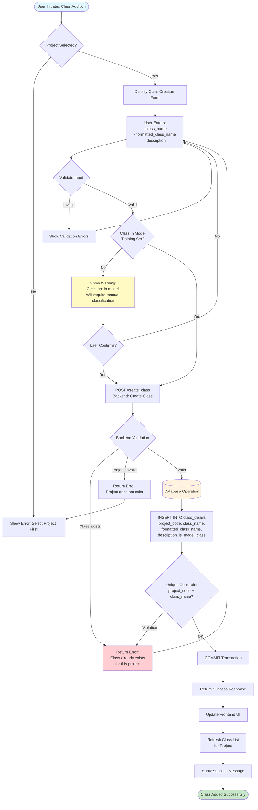

# Class Operations Flowcharts - Complete Implementation Guide

This document provides comprehensive flowcharts for implementing class addition, merging, and splitting operations with project-specific classes.

---

## Table of Contents
1. [Class Addition Flowchart](#1-class-addition-flowchart)
2. [Class Merging Flowchart](#2-class-merging-flowchart)
3. [Class Splitting Flowchart](#3-class-splitting-flowchart)
4. [Database Schema Changes](#database-schema-changes)
5. [Backend Endpoints Summary](#backend-endpoints-summary)
6. [Frontend Components Summary](#frontend-components-summary)

---

## 1. Class Addition Flowchart



### Backend Changes for Class Addition

**File: `main.py`**

```python
@app.post("/create_class")
async def create_class(data: dict):
    """Create a new class for a specific project"""
    try:
        conn = sqlite3.connect(sqlite_db_path)
        cursor = conn.cursor()
        
        project_code = data.get('project_code')
        class_name = data.get('class_name')
        formatted_class_name = data.get('formatted_class_name', class_name)
        description = data.get('description', '')
        
        # Validate project exists
        cursor.execute("SELECT * FROM projects WHERE project_code = ?", (project_code,))
        if not cursor.fetchone():
            conn.close()
            return {"error": f"Project '{project_code}' does not exist"}
        
        # Check if class already exists for this project
        cursor.execute('''
            SELECT * FROM class_details 
            WHERE project_code = ? AND class_name = ?
        ''', (project_code, class_name))
        
        if cursor.fetchone():
            conn.close()
            return {"error": "Class already exists", 
                   "message": f"Class '{class_name}' already exists for project '{project_code}'"}
        
        # Check if class is in model's training set
        is_model_class = 1 if class_name in class_names else 0
        
        # Insert new class
        cursor.execute('''
            INSERT INTO class_details 
            (project_code, class_name, formatted_class_name, description, is_model_class)
            VALUES (?, ?, ?, ?, ?)
        ''', (project_code, class_name, formatted_class_name, description, is_model_class))
        
        conn.commit()
        conn.close()
        
        response = {
            "message": f"Class '{class_name}' created successfully for project '{project_code}'!",
            "is_model_class": bool(is_model_class)
        }
        
        if not is_model_class:
            response["note"] = "This class is not in the model's training set. Images will be classified as 'unclassified' until manually reviewed."
        
        return response
        
    except sqlite3.IntegrityError as e:
        return {"error": "Database constraint violation", "message": str(e)}
    except Exception as e:
        return {"error": f"Failed to create class: {str(e)}"}
```

### Frontend Changes for Class Addition

**File: `form.html` or `class.html`**

```javascript
async function createClass() {
    const projectCode = getSelectedProject();
    const className = document.getElementById('class_name_input').value.trim();
    const formattedName = document.getElementById('formatted_name_input').value.trim();
    const description = document.getElementById('description_input').value.trim();
    
    if (!projectCode) {
        showError('Please select a project first');
        return;
    }
    
    if (!className || !formattedName) {
        showError('Class name and formatted name are required');
        return;
    }
    
    // Validate class name format (lowercase, underscores)
    if (!/^[a-z0-9_]+$/.test(className)) {
        showError('Class name must be lowercase with underscores only');
        return;
    }
    
    try {
        const response = await fetch('/plankton_classifier/create_class', {
            method: 'POST',
            headers: {'Content-Type': 'application/json'},
            body: JSON.stringify({
                project_code: projectCode,
                class_name: className,
                formatted_class_name: formattedName,
                description: description
            })
        });
        
        const result = await response.json();
        
        if (result.error) {
            showError(result.message || result.error);
        } else {
            showSuccess(result.message);
            if (result.note) {
                showWarning(result.note);
            }
            refreshClassList(projectCode);
            clearForm();
        }
    } catch (error) {
        showError('Failed to create class: ' + error.message);
    }
}
```

---

## 2. Class Merging Flowchart

```mermaid
flowchart TD
    Start([User Initiates Class Merge]) --> SelectSource[User Selects Source Classes<br/>Multiple classes to merge]
    
    SelectSource --> SelectTarget[User Selects Target Class<br/>Class to merge into]
    
    SelectTarget --> ValidateSelection{Validate Selection}
    ValidateSelection -->|Same Project?| CheckProject{All Classes<br/>Same Project?}
    ValidateSelection -->|Invalid| ShowError[Show Error:<br/>Invalid Selection]
    ShowError --> SelectSource
    
    CheckProject -->|No| ShowProjectError[Show Error:<br/>Cannot merge classes<br/>from different projects]
    ShowProjectError --> SelectSource
    
    CheckProject -->|Yes| CheckTargetExists{Target Class<br/>Exists?}
    CheckTargetExists -->|No| ShowTargetError[Show Error:<br/>Target class does not exist]
    ShowTargetError --> SelectTarget
    
    CheckTargetExists -->|Yes| ShowPreview[Show Preview:<br/>- Source classes<br/>- Target class<br/>- Image count per class]
    
    ShowPreview --> UserConfirm{User Confirms Merge?}
    UserConfirm -->|No| Cancel[Cancel Operation]
    Cancel --> End
    
    UserConfirm -->|Yes| StartTransaction[Start Database Transaction]
    
    StartTransaction --> GetImageCounts[Get Image Counts<br/>for Each Source Class]
    
    GetImageCounts --> UpdateImages[Update image_data Table]
    
    UpdateImages --> LoopImages{For Each Source Class}
    LoopImages --> UpdateImageData[UPDATE image_data<br/>SET class_name = target_class<br/>WHERE class_name = source_class<br/>AND project_code = ?]
    
    UpdateImageData --> MoveFiles[Move Physical Files]
    
    MoveFiles --> LoopFolders{For Each Source Class Folder}
    LoopFolders --> GetSourcePath[Get Source Path:<br/>project/year/month/source_class/]
    
    GetSourcePath --> GetTargetPath[Get Target Path:<br/>project/year/month/target_class/]
    
    GetTargetPath --> CheckTargetFolder{Target Folder<br/>Exists?}
    CheckTargetFolder -->|No| CreateFolder[Create Target Folder]
    CheckTargetFolder -->|Yes| MoveFile[Move Image Files]
    CreateFolder --> MoveFile
    
    MoveFile --> UpdateFileSystem[Update File System:<br/>Move all images from<br/>source to target folder]
    
    UpdateFileSystem --> CheckMoreFolders{More Source<br/>Classes?}
    CheckMoreFolders -->|Yes| LoopFolders
    CheckMoreFolders -->|No| CheckMoreImages{More Source<br/>Classes?}
    
    CheckMoreImages -->|Yes| LoopImages
    CheckMoreImages -->|No| UpdateClassDetails[Update class_details Table]
    
    UpdateClassDetails --> DeleteSourceClasses[Option 1: Delete Source Classes<br/>DELETE FROM class_details<br/>WHERE class_name IN source_classes<br/>AND project_code = ?]
    
    DeleteSourceClasses --> OR[OR]
    
    OR --> MarkInactive[Option 2: Mark as Merged<br/>UPDATE class_details<br/>SET is_active = 0,<br/>merged_into = target_class<br/>WHERE class_name IN source_classes]
    
    MarkInactive --> CommitTransaction[COMMIT Transaction]
    
    CommitTransaction --> LogOperation[Log Merge Operation<br/>to audit table]
    
    LogOperation --> ReturnSuccess[Return Success Response]
    
    ReturnSuccess --> UpdateFrontend[Update Frontend UI]
    
    UpdateFrontend --> RefreshClassList[Refresh Class List]
    RefreshClassList --> RefreshImageList[Refresh Image List]
    RefreshImageList --> ShowSuccess[Show Success Message<br/>with merge summary]
    
    ShowSuccess --> End([Merge Complete])
    
    style Start fill:#e1f5ff
    style End fill:#c8e6c9
    style StartTransaction fill:#fff3e0
    style UpdateImages fill:#fff3e0
    style MoveFiles fill:#fff3e0
    style ShowError fill:#ffcdd2
    style ShowPreview fill:#fff9c4
```



### Backend Changes for Class Merging

**File: `main.py`**

```python
@app.post("/merge_classes")
async def merge_classes(data: dict):
    """Merge multiple source classes into a target class"""
    try:
        project_code = data.get('project_code')
        source_classes = data.get('source_classes', [])  # List of class names
        target_class = data.get('target_class')
        
        if not project_code or not source_classes or not target_class:
            return {"error": "Missing required parameters"}
        
        if target_class in source_classes:
            return {"error": "Target class cannot be in source classes list"}
        
        conn = sqlite3.connect(sqlite_db_path)
        cursor = conn.cursor()
        
        # Start transaction
        cursor.execute("BEGIN TRANSACTION")
        
        try:
            # Verify all classes belong to the same project
            placeholders = ','.join(['?'] * (len(source_classes) + 1))
            query = f'''
                SELECT DISTINCT project_code 
                FROM class_details 
                WHERE class_name IN ({placeholders})
            '''
            cursor.execute(query, source_classes + [target_class])
            project_codes = [row[0] for row in cursor.fetchall()]
            
            if len(project_codes) != 1 or project_codes[0] != project_code:
                raise ValueError("All classes must belong to the same project")
            
            # Get image counts before merge
            image_counts = {}
            for source_class in source_classes:
                cursor.execute('''
                    SELECT COUNT(*) FROM image_data id
                    JOIN bin_data bd ON id.bin_name = bd.bin_name
                    WHERE id.class_name = ? AND bd.project_code = ?
                ''', (source_class, project_code))
                image_counts[source_class] = cursor.fetchone()[0]
            
            # Update image_data table - move all images to target class
            for source_class in source_classes:
                # Get all images for this source class in this project
                cursor.execute('''
                    UPDATE image_data
                    SET class_name = ?
                    WHERE class_name = ?
                    AND bin_name IN (
                        SELECT bin_name FROM bin_data WHERE project_code = ?
                    )
                ''', (target_class, source_class, project_code))
                
                # Move physical files
                # Get all unique year/month combinations for this class
                cursor.execute('''
                    SELECT DISTINCT 
                        SUBSTR(bin_name, INSTR(bin_name, 'D') + 1, 6) as year_month
                    FROM bin_data
                    WHERE project_code = ?
                ''', (project_code,))
                
                year_months = cursor.fetchall()
                
                for (year_month,) in year_months:
                    year = year_month[:4]
                    month = year_month[4:6]
                    
                    source_folder = os.path.join(
                        data_directory, project_code, year, month, source_class
                    )
                    target_folder = os.path.join(
                        data_directory, project_code, year, month, target_class
                    )
                    
                    if os.path.exists(source_folder):
                        # Create target folder if it doesn't exist
                        os.makedirs(target_folder, exist_ok=True)
                        
                        # Move all files
                        for filename in os.listdir(source_folder):
                            source_path = os.path.join(source_folder, filename)
                            target_path = os.path.join(target_folder, filename)
                            shutil.move(source_path, target_path)
                        
                        # Remove empty source folder
                        try:
                            os.rmdir(source_folder)
                        except OSError:
                            pass  # Folder not empty or doesn't exist
            
            # Delete source classes from class_details (or mark as inactive)
            cursor.execute(f'''
                DELETE FROM class_details
                WHERE class_name IN ({','.join(['?'] * len(source_classes))})
                AND project_code = ?
            ''', source_classes + [project_code])
            
            # Commit transaction
            conn.commit()
            
            # Prepare response
            total_images = sum(image_counts.values())
            response = {
                "message": f"Successfully merged {len(source_classes)} classes into '{target_class}'",
                "merged_classes": source_classes,
                "target_class": target_class,
                "images_moved": total_images,
                "image_counts": image_counts
            }
            
            conn.close()
            return response
            
        except Exception as e:
            conn.rollback()
            conn.close()
            raise e
            
    except Exception as e:
        return {"error": f"Failed to merge classes: {str(e)}"}
```

### Frontend Changes for Class Merging

**File: `class.html` or new `merge_classes.html`**

```javascript
let selectedSourceClasses = new Set();

function selectSourceClass(className) {
    if (selectedSourceClasses.has(className)) {
        selectedSourceClasses.delete(className);
    } else {
        selectedSourceClasses.add(className);
    }
    updateMergeUI();
}

function updateMergeUI() {
    const sourceList = document.getElementById('source_classes_list');
    sourceList.innerHTML = '';
    
    selectedSourceClasses.forEach(className => {
        const div = document.createElement('div');
        div.className = 'selected-class';
        div.innerHTML = `
            <span>${className}</span>
            <button onclick="selectSourceClass('${className}')">Remove</button>
        `;
        sourceList.appendChild(div);
    });
    
    document.getElementById('merge_button').disabled = 
        selectedSourceClasses.size < 2 || !document.getElementById('target_class_select').value;
}

async function previewMerge() {
    const projectCode = getSelectedProject();
    const sourceClasses = Array.from(selectedSourceClasses);
    const targetClass = document.getElementById('target_class_select').value;
    
    if (!targetClass || sourceClasses.length < 2) {
        showError('Please select at least 2 source classes and a target class');
        return;
    }
    
    // Fetch image counts
    const imageCounts = {};
    for (const className of sourceClasses) {
        const response = await fetch(
            `/plankton_classifier/get_class_image_count/${projectCode}/${className}`
        );
        const data = await response.json();
        imageCounts[className] = data.count || 0;
    }
    
    // Show preview modal
    showMergePreview(sourceClasses, targetClass, imageCounts);
}

async function executeMerge() {
    const projectCode = getSelectedProject();
    const sourceClasses = Array.from(selectedSourceClasses);
    const targetClass = document.getElementById('target_class_select').value;
    
    if (!confirm(`Merge ${sourceClasses.length} classes into '${targetClass}'? This cannot be undone.`)) {
        return;
    }
    
    try {
        const response = await fetch('/plankton_classifier/merge_classes', {
            method: 'POST',
            headers: {'Content-Type': 'application/json'},
            body: JSON.stringify({
                project_code: projectCode,
                source_classes: sourceClasses,
                target_class: targetClass
            })
        });
        
        const result = await response.json();
        
        if (result.error) {
            showError(result.error);
        } else {
            showSuccess(result.message);
            console.log('Images moved:', result.images_moved);
            refreshClassList(projectCode);
            selectedSourceClasses.clear();
            updateMergeUI();
        }
    } catch (error) {
        showError('Failed to merge classes: ' + error.message);
    }
}
```

---

## 3. Class Splitting Flowchart

```mermaid
flowchart TD
    Start([User Initiates Class Split]) --> SelectSource[User Selects Source Class<br/>Class to split]
    
    SelectSource --> ValidateSource{Source Class<br/>Exists?}
    ValidateSource -->|No| ShowError[Show Error:<br/>Class does not exist]
    ShowError --> SelectSource
    
    ValidateSource -->|Yes| LoadImages[Load Images<br/>from Source Class]
    
    LoadImages --> ShowImageGrid[Display Image Grid<br/>with Selection UI]
    
    ShowImageGrid --> UserSelect[User Selects Images<br/>to Split]
    
    UserSelect --> CreateTargetClass[User Creates/Selects<br/>Target Class Name]
    
    CreateTargetClass --> CheckTargetExists{Target Class<br/>Exists?}
    CheckTargetExists -->|No| CreateNewClass[Create New Class<br/>in class_details]
    CheckTargetExists -->|Yes| ValidateTarget{Target Class<br/>Same Project?}
    
    CreateNewClass --> ValidateTarget
    ValidateTarget -->|No| ShowProjectError[Show Error:<br/>Target class must be<br/>in same project]
    ShowProjectError --> CreateTargetClass
    
    ValidateTarget -->|Yes| ShowPreview[Show Preview:<br/>- Source class<br/>- Target class<br/>- Selected image count<br/>- Remaining image count]
    
    ShowPreview --> UserConfirm{User Confirms Split?}
    UserConfirm -->|No| Cancel[Cancel Operation]
    Cancel --> End
    
    UserConfirm -->|Yes| StartTransaction[Start Database Transaction]
    
    StartTransaction --> GetSelectedImages[Get Selected Image Names]
    
    GetSelectedImages --> UpdateImageData[Update image_data Table]
    
    UpdateImageData --> LoopImages{For Each Selected Image}
    LoopImages --> UpdateRecord[UPDATE image_data<br/>SET class_name = target_class<br/>WHERE file_name = image_name<br/>AND class_name = source_class<br/>AND bin_name IN<br/>SELECT bin_name FROM bin_data<br/>WHERE project_code = ?]
    
    UpdateRecord --> MoveFile[Move Physical File]
    
    MoveFile --> GetImagePath[Get Image Path:<br/>Extract year/month from bin_name]
    
    GetImagePath --> GetSourcePath[Source Path:<br/>project/year/month/source_class/image.png]
    
    GetSourcePath --> GetTargetPath[Target Path:<br/>project/year/month/target_class/image.png]
    
    GetTargetPath --> CheckTargetFolder{Target Folder<br/>Exists?}
    CheckTargetFolder -->|No| CreateFolder[Create Target Folder]
    CheckTargetFolder -->|Yes| MovePhysicalFile[Move Image File]
    CreateFolder --> MovePhysicalFile
    
    MovePhysicalFile --> CheckMoreImages{More Images<br/>to Process?}
    CheckMoreImages -->|Yes| LoopImages
    CheckMoreImages -->|No| CheckSourceEmpty{Source Class<br/>Empty Now?}
    
    CheckSourceEmpty -->|Yes| OptionDelete[Option: Delete Source Class<br/>if empty]
    CheckSourceEmpty -->|No| KeepSource[Keep Source Class<br/>with remaining images]
    
    OptionDelete --> CommitTransaction[COMMIT Transaction]
    KeepSource --> CommitTransaction
    
    CommitTransaction --> LogOperation[Log Split Operation<br/>to audit table]
    
    LogOperation --> ReturnSuccess[Return Success Response]
    
    ReturnSuccess --> UpdateFrontend[Update Frontend UI]
    
    UpdateFrontend --> RefreshClassList[Refresh Class List]
    RefreshClassList --> RefreshImageList[Refresh Image List<br/>for Both Classes]
    RefreshImageList --> ShowSuccess[Show Success Message<br/>with split summary]
    
    ShowSuccess --> End([Split Complete])
    
    style Start fill:#e1f5ff
    style End fill:#c8e6c9
    style StartTransaction fill:#fff3e0
    style UpdateImageData fill:#fff3e0
    style MoveFile fill:#fff3e0
    style ShowError fill:#ffcdd2
    style ShowPreview fill:#fff9c4
```



### Backend Changes for Class Splitting

**File: `main.py`**

```python
@app.post("/split_class")
async def split_class(data: dict):
    """Split images from a source class into a target class"""
    try:
        project_code = data.get('project_code')
        source_class = data.get('source_class')
        target_class = data.get('target_class')
        image_names = data.get('image_names', [])  # List of image file names
        
        if not all([project_code, source_class, target_class, image_names]):
            return {"error": "Missing required parameters"}
        
        if source_class == target_class:
            return {"error": "Source and target classes cannot be the same"}
        
        conn = sqlite3.connect(sqlite_db_path)
        cursor = conn.cursor()
        
        # Start transaction
        cursor.execute("BEGIN TRANSACTION")
        
        try:
            # Verify both classes belong to the same project
            cursor.execute('''
                SELECT project_code FROM class_details
                WHERE class_name IN (?, ?)
                GROUP BY project_code
            ''', (source_class, target_class))
            
            project_codes = [row[0] for row in cursor.fetchall()]
            
            if project_code not in project_codes or len(project_codes) != 1:
                raise ValueError("Both classes must belong to the same project")
            
            # Check if target class exists, create if not
            cursor.execute('''
                SELECT * FROM class_details
                WHERE project_code = ? AND class_name = ?
            ''', (project_code, target_class))
            
            if not cursor.fetchone():
                # Create target class
                is_model_class = 1 if target_class in class_names else 0
                cursor.execute('''
                    INSERT INTO class_details
                    (project_code, class_name, formatted_class_name, description, is_model_class)
                    VALUES (?, ?, ?, ?, ?)
                ''', (project_code, target_class, target_class.replace('_', ' ').title(), '', is_model_class))
            
            # Get image file names without extension for database lookup
            image_names_no_ext = [img.replace('.png', '') for img in image_names]
            
            # Update image_data table
            placeholders = ','.join(['?'] * len(image_names_no_ext))
            cursor.execute(f'''
                UPDATE image_data
                SET class_name = ?
                WHERE file_name IN ({placeholders})
                AND class_name = ?
                AND bin_name IN (
                    SELECT bin_name FROM bin_data WHERE project_code = ?
                )
            ''', [target_class] + image_names_no_ext + [source_class, project_code])
            
            rows_updated = cursor.rowcount
            
            # Move physical files
            moved_files = []
            for image_name in image_names:
                # Get bin_name for this image to extract year/month
                cursor.execute('''
                    SELECT id.bin_name, id.file_name
                    FROM image_data id
                    JOIN bin_data bd ON id.bin_name = bd.bin_name
                    WHERE id.file_name = ? 
                    AND id.class_name = ?
                    AND bd.project_code = ?
                    LIMIT 1
                ''', (image_name.replace('.png', ''), target_class, project_code))
                
                result = cursor.fetchone()
                if result:
                    bin_name = result[0]
                    
                    # Extract year/month from bin_name (format: IFCBXXX_YYYYMMDD...)
                    try:
                        year_month_str = bin_name.split('D')[1][:6]
                        year = year_month_str[:4]
                        month = year_month_str[4:6]
                    except:
                        continue  # Skip if can't parse
                    
                    source_path = os.path.join(
                        data_directory, project_code, year, month, source_class, image_name
                    )
                    target_path = os.path.join(
                        data_directory, project_code, year, month, target_class, image_name
                    )
                    
                    if os.path.exists(source_path):
                        # Create target folder if it doesn't exist
                        os.makedirs(os.path.dirname(target_path), exist_ok=True)
                        
                        # Move file
                        shutil.move(source_path, target_path)
                        moved_files.append(image_name)
            
            # Check if source class is now empty
            cursor.execute('''
                SELECT COUNT(*) FROM image_data id
                JOIN bin_data bd ON id.bin_name = bd.bin_name
                WHERE id.class_name = ? AND bd.project_code = ?
            ''', (source_class, project_code))
            
            remaining_count = cursor.fetchone()[0]
            
            # Optionally delete source class if empty
            delete_if_empty = data.get('delete_if_empty', False)
            if delete_if_empty and remaining_count == 0:
                cursor.execute('''
                    DELETE FROM class_details
                    WHERE project_code = ? AND class_name = ?
                ''', (project_code, source_class))
            
            # Commit transaction
            conn.commit()
            
            response = {
                "message": f"Successfully split {len(moved_files)} images from '{source_class}' to '{target_class}'",
                "source_class": source_class,
                "target_class": target_class,
                "images_moved": len(moved_files),
                "remaining_in_source": remaining_count,
                "database_rows_updated": rows_updated
            }
            
            conn.close()
            return response
            
        except Exception as e:
            conn.rollback()
            conn.close()
            raise e
            
    except Exception as e:
        return {"error": f"Failed to split class: {str(e)}"}
```

### Frontend Changes for Class Splitting

**File: `class.html` or `reclassify.html`**

```javascript
let selectedImagesForSplit = new Set();

function selectImageForSplit(imageSrc) {
    if (selectedImagesForSplit.has(imageSrc)) {
        selectedImagesForSplit.delete(imageSrc);
    } else {
        selectedImagesForSplit.add(imageSrc);
    }
    updateSplitUI();
}

function updateSplitUI() {
    const count = selectedImagesForSplit.size;
    document.getElementById('split_count').textContent = count;
    document.getElementById('split_button').disabled = count === 0 || !document.getElementById('split_target_class').value;
}

async function showSplitDialog(sourceClass) {
    // Load images from source class
    const projectCode = getSelectedProject();
    const images = await fetchClassImages(projectCode, sourceClass);
    
    // Show split UI with image grid
    showSplitModal(sourceClass, images);
}

async function executeSplit() {
    const projectCode = getSelectedProject();
    const sourceClass = document.getElementById('split_source_class').value;
    const targetClass = document.getElementById('split_target_class').value;
    const imageUrls = Array.from(selectedImagesForSplit);
    
    // Extract image names from URLs
    const imageNames = imageUrls.map(url => url.split('/').pop());
    
    if (!targetClass || imageNames.length === 0) {
        showError('Please select a target class and at least one image');
        return;
    }
    
    // Validate target class name format
    if (!/^[a-z0-9_]+$/.test(targetClass)) {
        showError('Target class name must be lowercase with underscores only');
        return;
    }
    
    if (!confirm(`Split ${imageNames.length} images from '${sourceClass}' to '${targetClass}'?`)) {
        return;
    }
    
    try {
        const response = await fetch('/plankton_classifier/split_class', {
            method: 'POST',
            headers: {'Content-Type': 'application/json'},
            body: JSON.stringify({
                project_code: projectCode,
                source_class: sourceClass,
                target_class: targetClass,
                image_names: imageNames,
                delete_if_empty: document.getElementById('delete_if_empty').checked
            })
        });
        
        const result = await response.json();
        
        if (result.error) {
            showError(result.error);
        } else {
            showSuccess(result.message);
            console.log('Images moved:', result.images_moved);
            console.log('Remaining in source:', result.remaining_in_source);
            
            // Refresh UI
            refreshClassList(projectCode);
            refreshImageList(projectCode, sourceClass);
            if (result.remaining_in_source === 0) {
                // Source class was deleted, refresh class list
                refreshClassList(projectCode);
            }
            
            selectedImagesForSplit.clear();
            closeSplitModal();
        }
    } catch (error) {
        showError('Failed to split class: ' + error.message);
    }
}
```

---

## Database Schema Changes

### Required Migration

**File: `migrations/migrate_class_details.sql`**

```sql
-- Add project_code column to class_details
ALTER TABLE class_details ADD COLUMN project_code TEXT;

-- Add is_model_class column
ALTER TABLE class_details ADD COLUMN is_model_class INTEGER DEFAULT 1;

-- Migrate existing data
UPDATE class_details 
SET project_code = (
    SELECT DISTINCT bd.project_code 
    FROM bin_data bd 
    JOIN image_data id ON bd.bin_name = id.bin_name 
    WHERE id.class_name = class_details.class_name 
    LIMIT 1
)
WHERE project_code IS NULL;

-- Set default for remaining NULLs
UPDATE class_details 
SET project_code = 'DEFAULT' 
WHERE project_code IS NULL;

-- Create unique constraint on (project_code, class_name)
CREATE UNIQUE INDEX IF NOT EXISTS idx_class_details_project_class 
ON class_details(project_code, class_name);

-- Create index for faster project lookups
CREATE INDEX IF NOT EXISTS idx_class_details_project 
ON class_details(project_code);

-- Optional: Add audit table for tracking operations
CREATE TABLE IF NOT EXISTS class_operations_audit (
    id INTEGER PRIMARY KEY AUTOINCREMENT,
    operation_type TEXT NOT NULL,  -- 'add', 'merge', 'split', 'delete'
    project_code TEXT NOT NULL,
    source_classes TEXT,  -- JSON array for merge/split
    target_class TEXT,
    images_affected INTEGER,
    performed_by TEXT,
    performed_at TIMESTAMP DEFAULT CURRENT_TIMESTAMP
);

CREATE INDEX IF NOT EXISTS idx_audit_project ON class_operations_audit(project_code);
CREATE INDEX IF NOT EXISTS idx_audit_type ON class_operations_audit(operation_type);
```

---

## Backend Endpoints Summary

### New Endpoints Required

1. **POST `/create_class`** - Create a new class for a project
   - Input: `project_code`, `class_name`, `formatted_class_name`, `description`
   - Output: Success message with `is_model_class` flag

2. **POST `/merge_classes`** - Merge multiple classes into one
   - Input: `project_code`, `source_classes[]`, `target_class`
   - Output: Merge summary with image counts

3. **POST `/split_class`** - Split images from one class to another
   - Input: `project_code`, `source_class`, `target_class`, `image_names[]`, `delete_if_empty`
   - Output: Split summary with remaining counts

4. **GET `/get_class_image_count/{project_code}/{class_name}`** - Get image count for a class
   - Output: `{"count": number}`

5. **GET `/get_project_classes/{project_code}`** - Get all classes for a project
   - Output: List of classes with metadata

### Updated Endpoints

1. **GET `/class_names`** - Now accepts `project_code` parameter
2. **GET `/moveImageToFolder`** - Already exists, may need project_code validation

---

## Frontend Components Summary

### New UI Components Needed

1. **Class Creation Form**
   - Input fields for class name, formatted name, description
   - Project selection
   - Validation and error display

2. **Class Merge Interface**
   - Multi-select for source classes
   - Target class selector
   - Preview with image counts
   - Confirmation dialog

3. **Class Split Interface**
   - Image grid with selection
   - Target class input/selector
   - Preview with selected image count
   - Option to delete source class if empty

### Updated Components

1. **Class List Display** - Filter by project
2. **Image Grid** - Show project-specific classes
3. **Reclassify Interface** - Validate against project classes

---

## Implementation Order

1. ✅ **Database Migration** - Add `project_code` to `class_details`
2. ✅ **Backend: Class Addition** - Implement `/create_class` endpoint
3. ✅ **Frontend: Class Addition** - Build class creation UI
4. ✅ **Backend: Class Merging** - Implement `/merge_classes` endpoint
5. ✅ **Frontend: Class Merging** - Build merge interface
6. ✅ **Backend: Class Splitting** - Implement `/split_class` endpoint
7. ✅ **Frontend: Class Splitting** - Build split interface
8. ✅ **Testing** - Test all operations with various scenarios
9. ✅ **Documentation** - Update user documentation

---

## Error Handling

All operations should handle:
- Database constraint violations
- File system errors
- Missing projects/classes
- Invalid image references
- Transaction rollbacks on failure
- User-friendly error messages

---

## Security Considerations

- Validate user permissions for project operations
- Sanitize file paths to prevent directory traversal
- Validate class names to prevent injection
- Log all operations for audit trail
- Confirm destructive operations (merge, split) with user

---

## Notes

- All operations are project-scoped
- Classes can have the same name in different projects
- Model classes vs. manual classes are tracked via `is_model_class`
- Physical file operations must match database updates
- Transactions ensure data consistency

